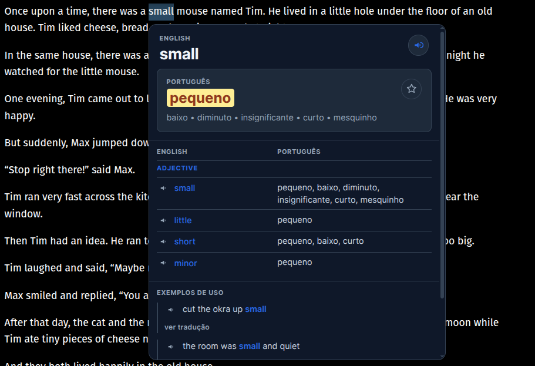
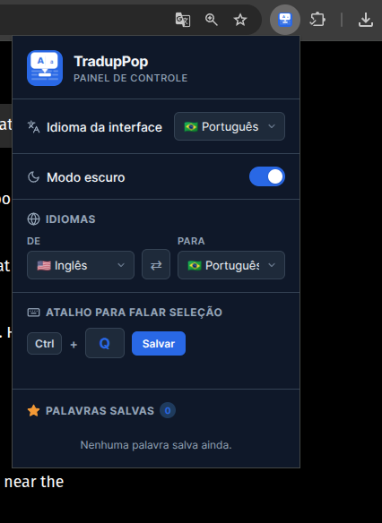

# TradupPop

> Selecione qualquer palavra ou frase em uma página web e receba a tradução instantaneamente com áudio, dicionário e exemplos de uso.

## Preview

### Popup de tradução na página

Ao selecionar uma palavra ou frase, o TradupPop abre um popup contextual com tradução, áudio e dicionário.



### Painel de controle da extensão

No painel, você ajusta idioma, preferências e recursos para personalizar a experiência.



## O que é

**TradupPop** é uma extensão para Google Chrome que traduz palavras e frases diretamente na página, sem precisar abrir uma nova aba ou copiar o texto. Basta selecionar e o popup aparece na hora.

Criada para quem está aprendendo um novo idioma e quer entender o significado de palavras sem perder o contexto da leitura.

## Instalação

1. Clone ou baixe este repositório
2. Abra `chrome://extensions/` no Chrome
3. Ative o **Modo do desenvolvedor** (canto superior direito)
4. Clique em **Carregar sem compactação**
5. Selecione a pasta do projeto
6. Pronto — acesse qualquer página e selecione um texto

## Como usar

| Ação | Resultado |
|---|---|
| Selecionar uma palavra | Popup com tradução + dicionário |
| Selecionar uma frase | Popup com tradução + alternativas |
| Clicar em 🔊 | Ouve a palavra no idioma original |
| Clicar em ★ | Salva a palavra no seu vocabulário |
| Clicar numa alternativa | Retraduz aquela palavra |
| Clicar em voltar | Retorna à palavra anterior |
| `Ctrl + Q` | Ouve o texto selecionado |
| `Esc` | Fecha o popup |

## Funcionalidades

- **Tradução instantânea** — selecione qualquer texto e o popup aparece automaticamente
- **Áudio TTS** — ouça a pronúncia da palavra no idioma original
- **Dicionário integrado** — definições, classe gramatical e sinônimos
- **Exemplos de uso** — frases reais com a palavra em contexto
- **Outras traduções** — alternativas clicáveis para explorar variações
- **Navegação por histórico** — botão voltar para palavras anteriores
- **Salvar palavras** — crie seu vocabulário pessoal
- **Múltiplos idiomas** — suporte a EN, PT, ES, FR, DE, IT, JA, ZH, KO, RU
- **Atalho de teclado** — `Ctrl + Q` para ouvir a seleção (configurável)
- **Modo escuro** — interface adaptável
- **Painel de controle** — configure idiomas, atalho e palavras salvas

## Painel de controle

Clique no ícone da extensão para abrir o painel onde você pode:

- Trocar o idioma da interface (PT, EN, ES, FR, DE)
- Selecionar idioma de origem e destino
- Configurar o atalho de teclado
- Ativar/desativar modo escuro
- Ver e gerenciar palavras salvas

## Tecnologias

- **Manifest V3** — padrão atual de extensões Chrome
- **Google Translate API** — tradução principal
- **MyMemory API** — fallback de tradução
- **Google TTS** — síntese de voz
- **Web Speech API** — fallback de áudio
- **Chrome Storage API** — persistência de dados local

## Estrutura do projeto

```text
tradupop/
├── manifest.json       # Configuração da extensão
├── background.js       # Service worker — lógica de tradução
├── content.js          # Script injetado nas páginas
├── styles.css          # Estilos do popup de tradução
├── ui-strings.js       # Strings de interface (i18n)
├── popup.html          # Painel de controle
├── popup.js            # Lógica do painel de controle
└── popup.css           # Estilos do painel de controle
```

## Em evolução

Este é um projeto funcional, mas em evolução. Ainda há pontos que podem ser melhorados em desempenho, qualidade de tradução e experiência de uso.

## Autor

Criado por **José Lucas**

- GitHub: [@lucasaffonso0](https://github.com/lucasaffonso0/)
- LinkedIn: [lucasaffonso0](https://www.linkedin.com/in/lucasaffonso0/)
